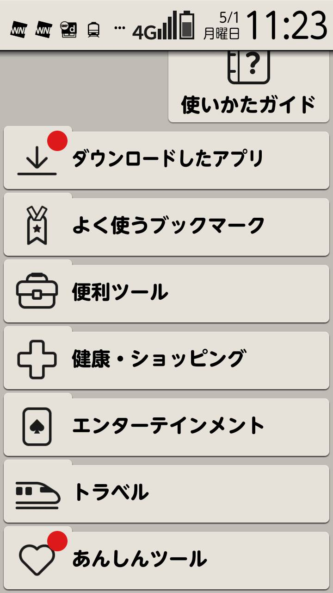
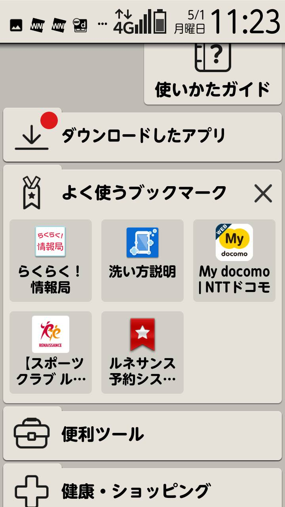
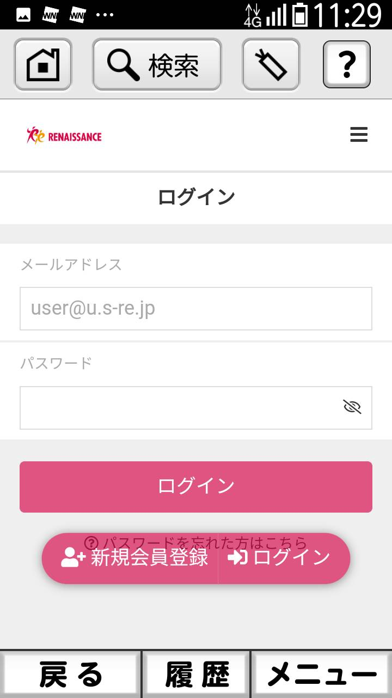
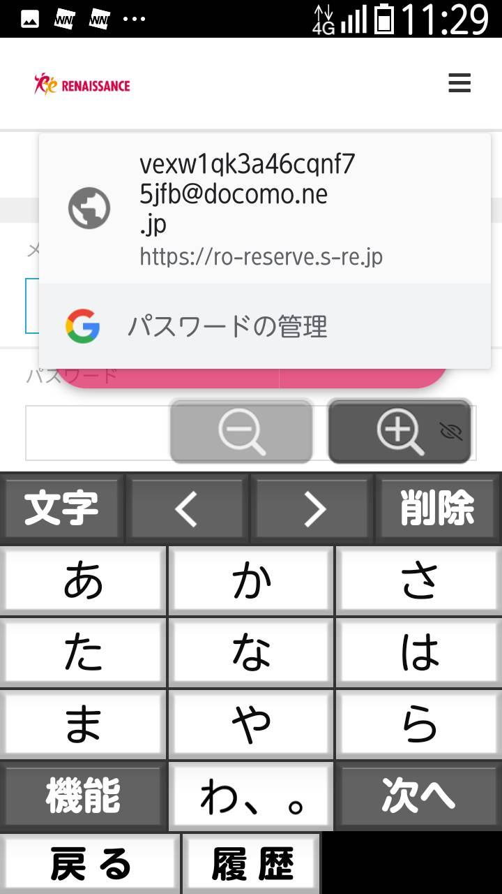
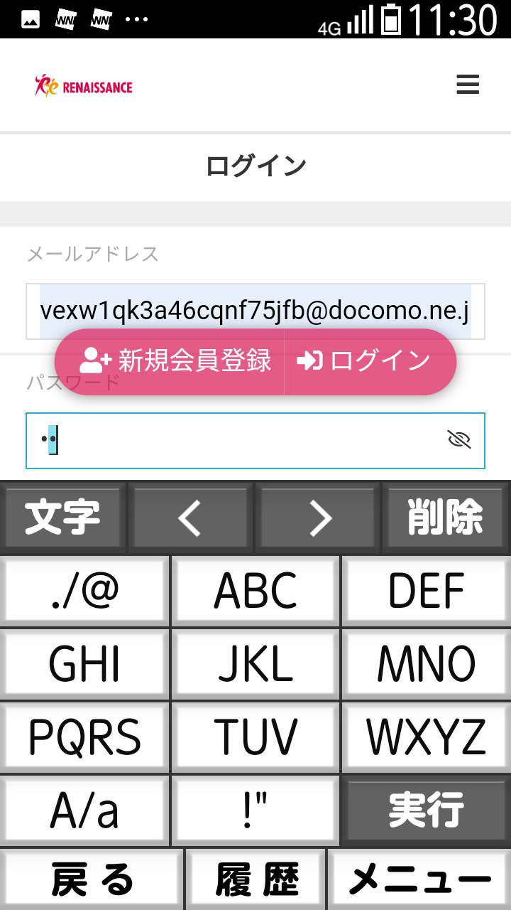
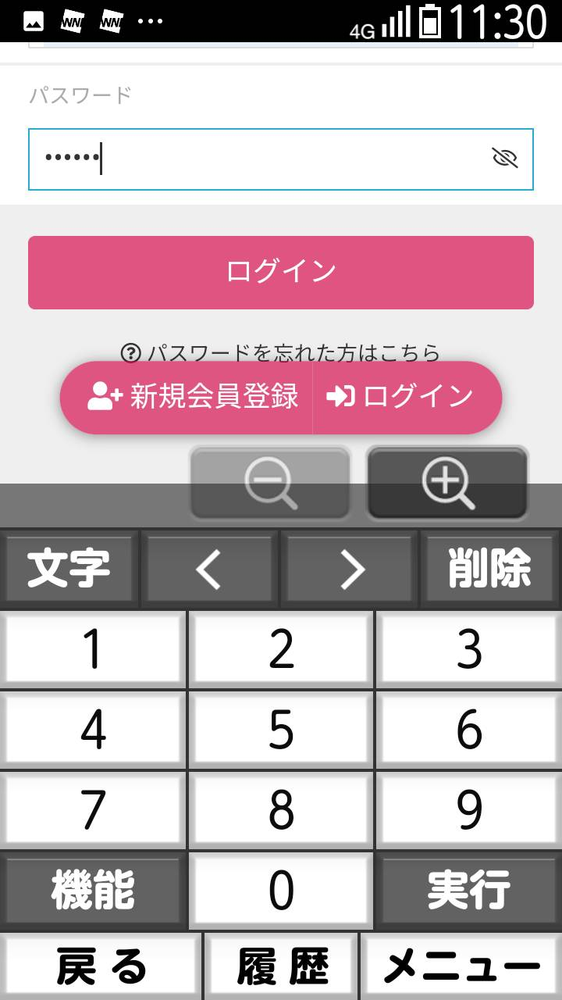
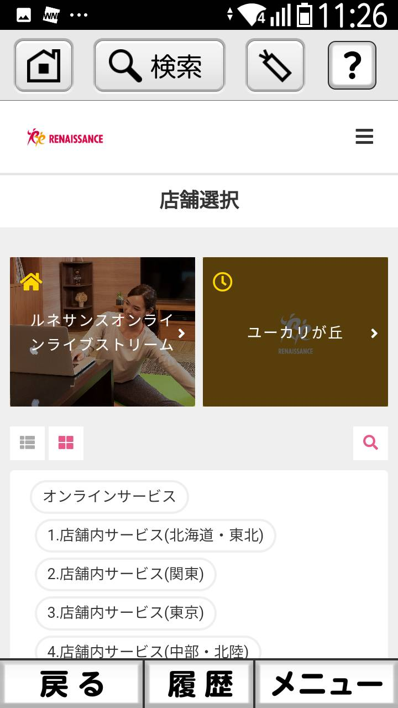
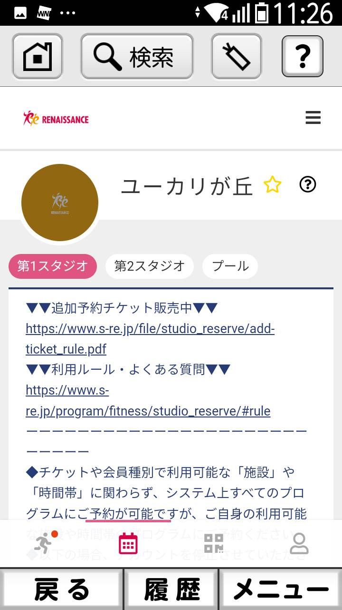
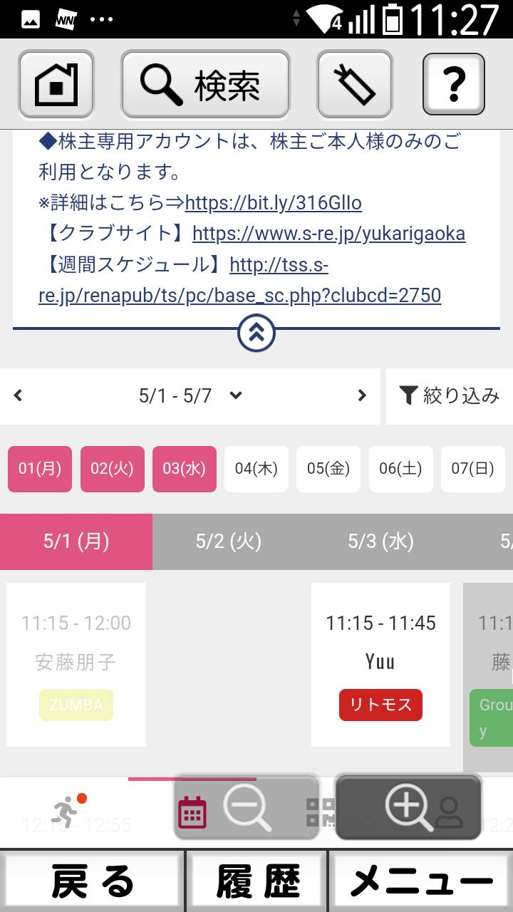
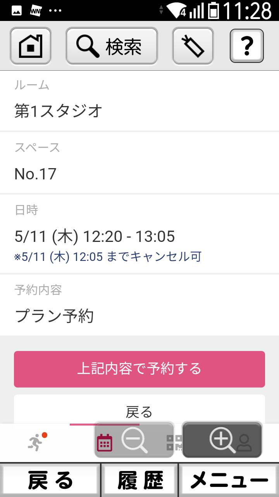

# ルネサンス予約方法
1. スマホを開いて下に画面移動
2. 「よく使うブックマーク」をタップ  

3. 「ルネサンス予約シス…」をタップ  
    
4. 長四角をタップ  
  
   1. 表示されない場合
   2. 手順 9 以降を実施
5. 「 vexw …」をタップ  

6. パスワードの長四角をタップ  

7. 「hc1213」を入力  
8. 「ログイン」をタップ  

9.  「ユーカリが丘」をタップ  

10. 「第1 スタジオ」「第2 スタジオ」「プール」のどれかをタップ  

11. 下に画面移動をし、日付選択をする  
    1.  (ア) 日単位で見る場合
        1.  ① をタップ  
          
        2.  ② 予約したい日付をタップし、絞り込みをタップする  
          
    2. (イ) 週単位で見る場合
       1. ① 「＜」や「＞」をタップ  
          
12. 予約したいレッスンをタップ  
13. 予約したい場所をタップ  

14. 「プランで予約する」をタップ「プランで予約する」をタップ  

15. 「上記内容で予約する」をタップ「上記内容で予約する」をタップ  
